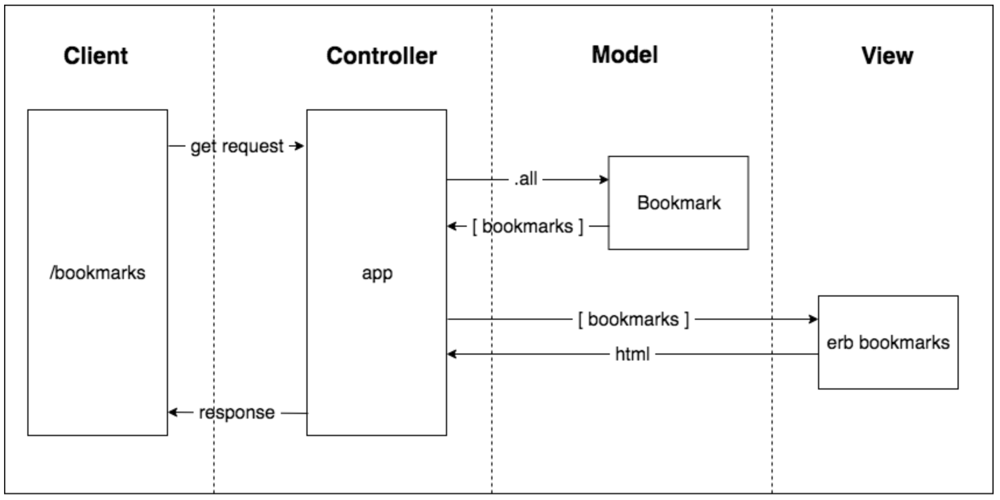

# BOOKMARK MANAGER

## REQUIREMENTS

Show a list of bookmarks  
Add new bookmarks  
Delete bookmarks  
Update bookmarks  
Comment on bookmarks  
Tag bookmarks into categories  
Filter bookmarks by tag  
Users are restricted to manage only their own bookmarks

## USER STORIES

As a user,  
So that I can see my saved bookmarks,  
I'd like to show a list of bookmarks

As a user,  
So that I can save a website  
I'd like to add new bookmarks to my list of bookmarks

As a user,  
So that I can keep my list of bookmarks relevant  
I'd like to delete bookmarks from my list of bookmarks

As a user,  
So that I can change information about my bookmarks  
I'd like to update my bookmarks

As a user,  
So that I can record information about my bookmarks  
I'd like to comment on my bookmarks

As a user,  
So that I can organize my bookmarks  
I'd like to tag bookmarks into categories

As a user,  
So that I can easily search for bookmarks  
I'd like to filter my bookmarks by tag

As a user,  
So that I manage my own bookmarks  
I'd like my access to bookmarks to be restricted

## DOMAIN MODEL

## SETTING UP THE DATABASE

1. Connect to `psql` (you may need to install postgresql first by running `brew install postgres`)
2. Create the database using the psql command `CREATE DATABASE bookmark_manager`
3. Connect to the database using the pqsl command `\c bookmark_manager`
4. Run the query we have saved in the file **01_create_bookmarks_table.sql**
